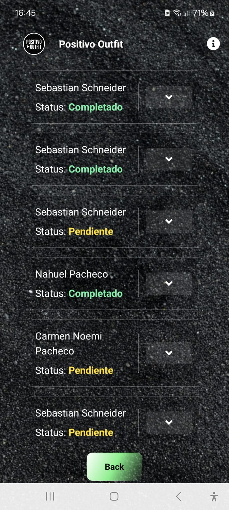
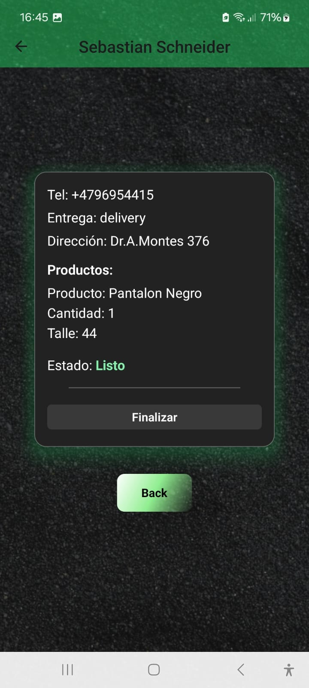
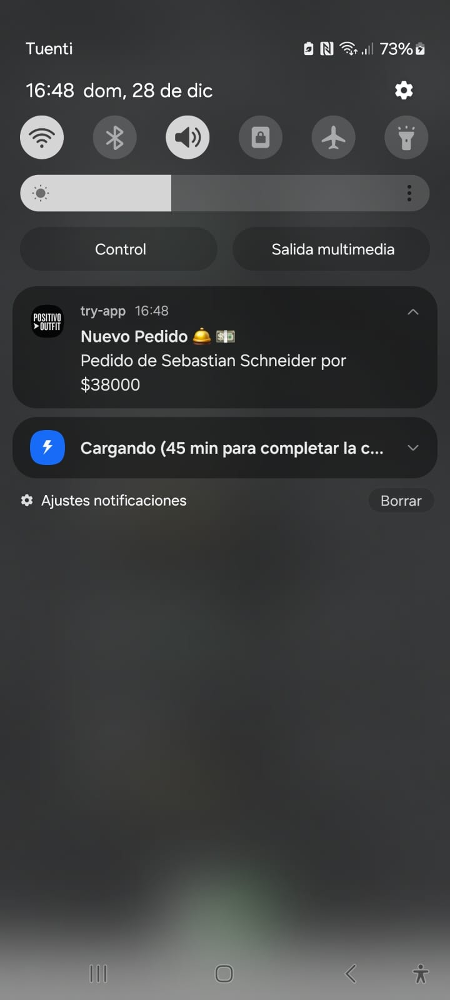

# 🚀 Try App - React Native


---

## ✨ Description

**Try App** is an app designed to connect with your Sales Website and allow you to view your Pending Orders and receive Push Notifications on your mobile about new orders.

**You Can Check it Out in this Link** : 

---

## 🖼️ Screenshots

<p align="center">
    
    
    
</p>

---

## ⚡ Features

- 📱 Modern and user-friendly interface
- 🚀 Fast and lightweight
- 🛠️ Easy to customize and expand
- 🌙 Dark mode support
- 🔥 Compatible with Android and iOS

---

## 🛠️ Installation

```bash
git clone https://github.com/seba100/try-app.git
cd try-app
npm install
npx expo start --dev-client # or run-ios
```

---

## 🤝 Contributions

Contributions are welcome! Please open an issue or a pull request to improve the app.

---

## 📄 License

This project is under the MIT license.

---

<p align="center">
    Made by Sebastian Schneider
</p>